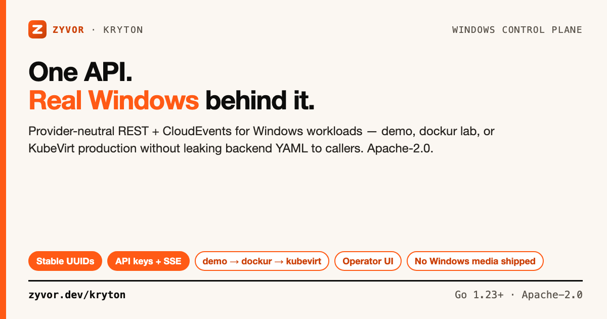

# Kryton

[](https://github.com/zyvorai/kryton/actions/workflows/ci.yml)
[](LICENSE)
[](https://go.dev/)
[](https://pkg.go.dev/github.com/zyvorai/kryton)



**One stable machine API. Real Windows behind the provider boundary.**

📖 **[User guide](docs/USER-GUIDE.md)** · **[Product docs](https://zyvor.dev/docs/kryton)** · **[API](docs/API.md)** · **[GA checklist](docs/GA.md)**

Kryton is an Apache-2.0 control plane for Windows workloads. Portals, CI, and automation talk to one REST + CloudEvents contract whether the backend is an in-memory **demo**, real Windows via **[dockur/windows](https://github.com/dockur/windows)** on a lab host, or **KubeVirt** on Kubernetes. It is not a Windows installer, activation service, or raw KubeVirt YAML factory.

> **Maturity (honest):** [`docs/GA.md`](docs/GA.md) is the production checklist — **`dockur` remains a lab installer, not GA**; multi-replica `krytond` is explicitly out of GA scope (single-writer reconciler, in-process event bus). **KubeVirt is the GA path.**

New here? [`docs/FAQ.md`](docs/FAQ.md) · troubleshooting in [USER-GUIDE](docs/USER-GUIDE.md#troubleshooting), [AUTH](docs/AUTH.md#troubleshooting), [KUBEVIRT](docs/KUBEVIRT.md#troubleshooting)

## Contents

- [Is this for you?](#is-this-for-you)
- [How to use Kryton](#how-to-use-kryton)
- [Quick start](#quick-start)
- [Install](#install)
- [KubeVirt](#kubevirt-windows-vms)
- [Remote deploy](#remote-deploy)
- [Dockur lab](#dockur-lab-provider)
- [Helm & authentication](#helm-kubevirt)
- [API & configuration](#api)
- [Development](#development)
- [What Kryton is not](#what-kryton-is-not)
- [Docs](#docs)
- [License](#license)

## Is this for you?

| | **Kryton** | VMware/Citrix VDI | Windows Admin Center | Plain KubeVirt |
|---|---|---|---|---|
| Scope | Stable machine API over interchangeable backends | Full VDI stack | GUI management | Kubernetes VM CRDs |
| API-first | REST + CloudEvents | Proprietary | GUI-first | Kubernetes API |
| Windows media | Not shipped — operator's job | Vendor-licensed | N/A | Not shipped |
| Lab → prod | Same API: `demo` → `dockur` → `kubevirt` | Separate tooling | N/A | Build your own app layer |

## How to use Kryton

Full walkthroughs: **[docs/USER-GUIDE.md](docs/USER-GUIDE.md)**.

| You are… | Do this | Provider | Auth |
|----------|---------|----------|------|
| Trying locally | `make demo` → `:8080` | `demo` | off |
| Real Windows in a lab | [Remote deploy](#remote-deploy) + [dockur](#dockur-lab-provider) | `dockur` | apikey |
| Production K8s | [Golden image](docs/GOLDEN-IMAGES.md) + [KubeVirt](#kubevirt-windows-vms) + Helm | `kubevirt` | apikey + TLS |
| Portal / CI | [API](#api) + `KRYTON_TOKEN` | any | apikey |

```text
  Veyron / Zeus / Atlas / Haven / Axiom / CI
                    │
             REST + CloudEvents
                    │
                 Kryton
           demo │ dockur │ kubevirt
```

## Quick start

Requires **Go 1.23+**.

```bash
git clone https://github.com/zyvorai/kryton.git && cd kryton
make demo
```

Open [http://localhost:8080](http://localhost:8080). Local demo uses `demo` provider with auth **disabled** — evaluation only.

```bash
go run ./cmd/krytonctl list
go run ./cmd/krytonctl create win-dev-01
go run ./cmd/krytonctl doctor
```

## Install

```bash
make build
sudo install -m755 bin/krytond bin/krytonctl /usr/local/bin/
```

Container: `docker build -t kryton:dev .` with `KRYTON_PROVIDER=demo`, `KRYTON_AUTH_MODE=disabled`, `KRYTON_ALLOW_INSECURE=true`.

| Target | What it does |
|--------|----------------|
| `make check` | fmt · test · vet · build |
| `make deploy-remote H=… U=…` | SSH deploy — [DEPLOY-REMOTE.md](docs/DEPLOY-REMOTE.md) |
| `make setup-kubevirt-production BUILD=1` | Golden + CDI + API + VM |

## KubeVirt Windows VMs

```bash
VERSION=11e ./scripts/build-golden-image.sh
export KRYTON_WINDOWS_IMAGE=./out/windows-11e-golden.qcow2
./scripts/setup-kubevirt.sh
```

See **[docs/KUBEVIRT.md](docs/KUBEVIRT.md)** and **[docs/GOLDEN-IMAGES.md](docs/GOLDEN-IMAGES.md)**.

## Remote deploy

```bash
make deploy-remote H=<host> U=<user> ARGS='--quick --key'
```

## Dockur lab provider

```bash
export KRYTON_PROVIDER=dockur
export KRYTON_DOCKUR_PUBLIC_HOST=<your-host-ip>
krytonctl create --image windows-11-enterprise --cpu 4 --memory 8192 lab-win01
```

See **[docs/DOCKUR.md](docs/DOCKUR.md)**.

## Helm (KubeVirt)

Production: KubeVirt + CDI, administrator `DataSource` objects, API-key auth. See **[docs/DEPLOYMENT.md](docs/DEPLOYMENT.md)** and `deploy/helm/kryton/README.md`.

**Authentication:** `./scripts/ensure-api-keys.sh` → `~/.kryton/lab.token`. Full guide: **[docs/AUTH.md](docs/AUTH.md)**.

## API

Discovery at `GET /api/v1`; machines at `GET/POST /api/v1/machines`; lifecycle, snapshots, events stream. OpenAPI: [`openapi.yaml`](openapi.yaml) and `/openapi.yaml`. Contract: **[docs/API.md](docs/API.md)**.

Configuration highlights: `KRYTON_PROVIDER`, `KRYTON_AUTH_MODE`, `KRYTON_ADDR`, `KRYTON_KUBECONFIG`, `KRYTON_STORAGE_CLASS`, `KRYTON_CORS_ORIGINS`, rate limits — full table in prior docs or `internal/config`.

## Development

```bash
make check && make test && make race && make vet
```

CI runs license headers, golangci-lint, govulncheck, gosec, tests, multi-arch `ghcr.io/zyvorai/kryton` publish. **[CONTRIBUTING.md](CONTRIBUTING.md)**.

## What Kryton is not

Not a Windows installer, activation service, or media distributor. Microsoft licensing remains the **operator's** responsibility.

## Docs

| Doc | Topic |
|-----|--------|
| **[USER-GUIDE.md](docs/USER-GUIDE.md)** | All personas — start here |
| [docs/README.md](docs/README.md) | Index |
| [GA.md](docs/GA.md) | Production checklist |
| [ARCHITECTURE.md](docs/ARCHITECTURE.md) | Provider boundary |
| [SECURITY.md](SECURITY.md) | Reporting |

Share cards: `./docs/social/build-social-card.sh`

## License

Apache-2.0 — see [LICENSE](LICENSE) and [NOTICE](NOTICE). Enterprise: [sales@zyvor.dev](mailto:sales@zyvor.dev) · [zyvor.dev](https://zyvor.dev).
